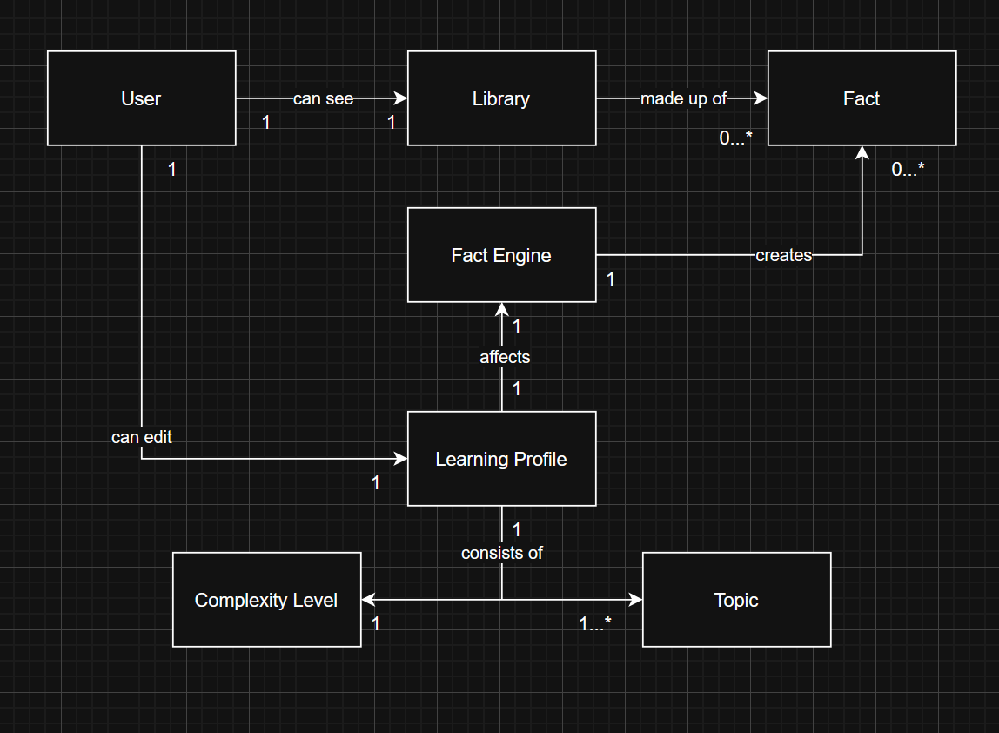
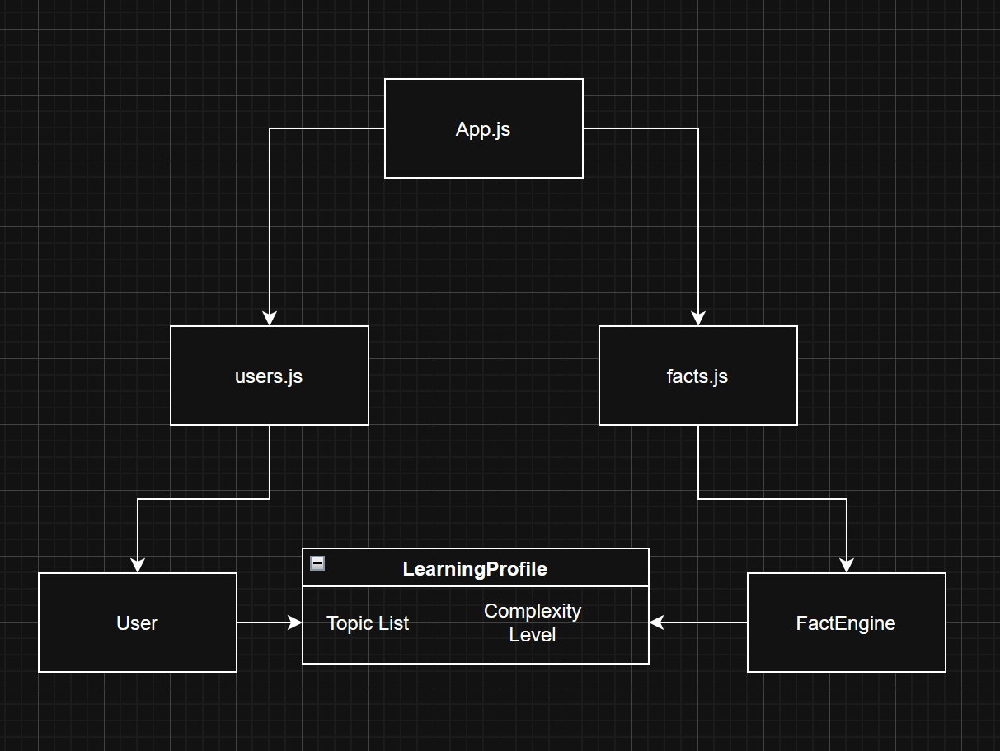

# [cite_start]Soph: A Curiosity-powered Fact Engine [cite: 1]
[cite_start]**A project by Nicolas Alonso Castillo** [cite: 2]

[cite_start]Soph is a doomscrolling alternative for people who want the feeling of understanding and identity that comes with doomscrolling, minus the constant sensation that they’re wasting time. [cite: 3] [cite_start]It will adapt to each user and learn about them in order to present interesting facts appropriate to the user’s interests, personality, and level of education. [cite: 4]

## [cite_start]User Profiles [cite: 5]

* [cite_start]**Bee** is a STEM student with an inquisitive mind. [cite: 6] [cite_start]Bee often finds her lectures too slow paced for her Gen-Z brain. [cite: 6] [cite_start]Soph allows her to complement her education with fun information during her unrelated classes. [cite: 7]
* [cite_start]**Luke** is a curious teenager who likes spending his time exploring the most recondite and bizarre parts of the internet. [cite: 8] [cite_start]Soph makes a more educational experience out of his website-browsing. [cite: 9]
* [cite_start]**Susannah** is a young woman that is having trouble with her doomscrolling addiction. [cite: 10] [cite_start]She finds herself wasting too much time on social media. [cite: 11] [cite_start]Soph allows for a similar experience that fulfills her TikTok cravings, without making her feel like she’s completely wasting her time. [cite: 12]

## [cite_start]Algorithmic Factors [cite: 13]

[cite_start]The biggest reason for doomscrolling’s addictive property is the ability of the TikTok/Reels/Shorts algorithm to connect with the user and understand what they want to see. [cite: 14] [cite_start]Fine-tuning the algorithm to create a similar feel is the most important part of the project. [cite: 15]

* [cite_start]The user will begin the experience by answering the question: How do you like your facts delivered? [cite: 16]
* [cite_start]If needed, the user will be prompted to answer follow-up questions. [cite: 17]
* [cite_start]There will be a feedback option at all times, for the user to manually fine-tune their experience. [cite: 18]

## [cite_start]Topics [cite: 19]

[cite_start]*(The following table outlines the topics and their corresponding categories [cite: 20])*

| Topic | Category 1 | Category 2 | Category 3 |
| :--- | :--- | :--- | :--- |
| Drawing | Creativity | | |
| Painting | Creativity | | |
| Photography | Creativity | | |
| Writing | Creativity | | |
| Music | Creativity | Culture | |
| Theater | Creativity | | |
| Dancing | Creativity | Culture | |
| Crafting | Creativity | | |
| Fashion | Creativity | Culture | |
| History | Humanities | | |
| Philosophy | Humanities | | |
| Psychology | Humanities | Social Sciences | |
| Politics | Social Sciences | | |
| Linguistics | Humanities | Culture | |
| Marine Biology | Science | Biology | |
| Animal Biology | Science | Biology | |
| Plant Biology | Science | Biology | |
| Physics | Science | | |
| Chemistry | Science | | |
| Global Culture | Humanities | Culture | |
| Cooking | Creativity | | |
| Religion | Humanities | | |
| Video games | Technology | Recreation | |
| Programming | Technology | | |
| Engineering | Technology | | |
| Internet Culture | Technology | Recreation | Culture |
| Exercise | Science | Wellness | Biology |
| Meditation | Wellness | | |
| Mental Health | Social Sciences | Wellness | Biology |
| Nutrition | Science | Wellness | |
| Skincare | Science | Wellness | |
| Astronomy | Science | | |
| Sustainability | Science | | |
| Sports | Recreation | | |
| Economics | Social Sciences | | |
| Architecture | Technology | | |
| Pharmacy | Science | Biology | |
| Math | Science | | |
| Gender Studies | Humanities | Social Sciences | Culture |
| Ethnic Studies | Humanities | Social Sciences | Culture |
| Comedy | Social Sciences | Culture | Creativity |

## [cite_start]Tones [cite: 21]

### [cite_start]Philosophy vs Practicality [cite: 22]
[cite_start]Some people like learning for the sake of learning, while others value the practical aspects of knowledge. [cite: 23] [cite_start]The focus can be on the information itself, or on its applications to the real world. [cite: 24]

### [cite_start]Buzzwords [cite: 25]
[cite_start]Academics tends to create terms for commonly used concepts. [cite: 26] [cite_start]This is useful for academic discourse, but makes it harder for the average person to understand their writing. [cite: 26] [cite_start]Some people like learning these buzzwords, but others find them unnecessary. [cite: 27]

### [cite_start]Formality [cite: 28]
[cite_start]While some might learn better with a more casual, conversational style of writing, others might prefer a more serious tone that they deem a trustworthy source. [cite: 29]

## [cite_start]Levels of Complexity [cite: 30]

* [cite_start]**Beginner:** Aimed for kids and people with low education, beginner mode offers a simplified academic experience that requires minimal background knowledge. [cite: 31] [cite_start]Complex facts will be excluded, and vocabulary will be kept simple. [cite: 32]
* [cite_start]**Intermediate:** Most users are expected to fall in this category. [cite: 33] [cite_start]Intermediate users are expected to be highly literate, and have moderate knowledge of their topics of interest. [cite: 34] [cite_start]The content of the facts won’t deviate significantly from the information in the sources, but heavy paraphrasing will be used to take the facts out of the academic style of writing. [cite: 35]
* [cite_start]**Advanced:** For scholars and academically-literate people. [cite: 36] [cite_start]Academic tone might be kept, and ideas from sources will simply be summarized. [cite: 36]

## [cite_start]Aesthetic [cite: 37]

[cite_start]CPFE will be personified as a wise, strong looking woman. [cite: 38] [cite_start]The site will feature an aged, vintage vibe that remains minimalistic, sleek, and clean. [cite: 39] [cite_start]Here is the color palette for the project: [cite: 40]

[cite_start]*(The following table displays the hex codes and usage [cite: 41])*

| Use | Color | Hex | Notes |
| :--- | :--- | :--- | :--- |
| Background | Antique Parchment | #F9F5EC | A warm, off-white with paper texture vibes |
| Text (primary) | Charcoal Ink | #2F2F2F | Deep, soft black for high readability |
| Accent text / headings | Sepia Brown | #6B4F3B | Gives a warm, old-book feel |
| Links / CTAs | Dusty Teal | #3F6963 | Muted teal with contrast and vintage charm |
| Borders / Secondary UI | Weathered Wood | #A89F91 | Aged gray-brown, non-distracting |
| Highlights / Hover | Ochre Gold | #C6A664 | Muted yellow gold for subtle attention |
| Error / Alert | Brick Red | #944E4E | Earthy, not harsh on the eyes |

## [cite_start]Architectural Design [cite: 42]

### [cite_start]Domain Model [cite: 43]

### [cite_start]Class Diagram (Backend) [cite: 44]

